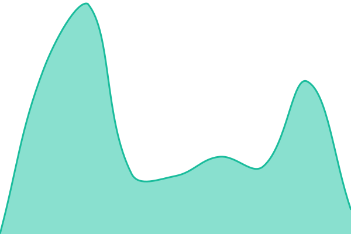
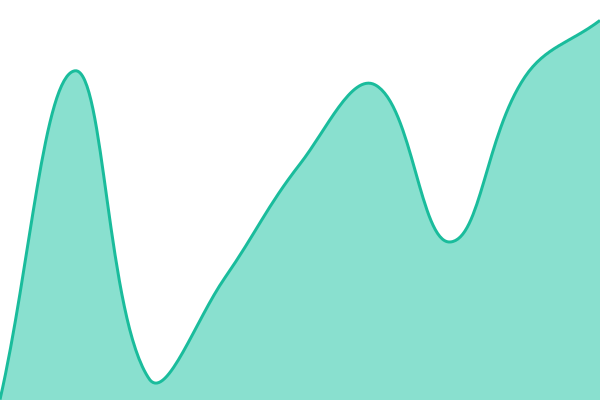
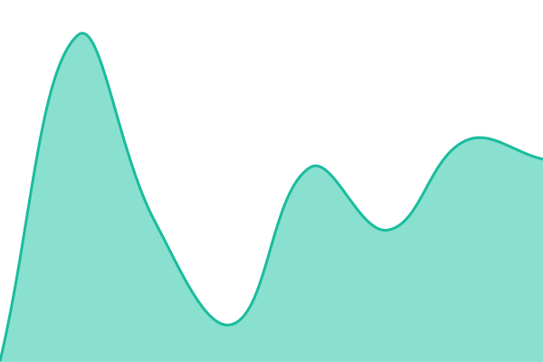
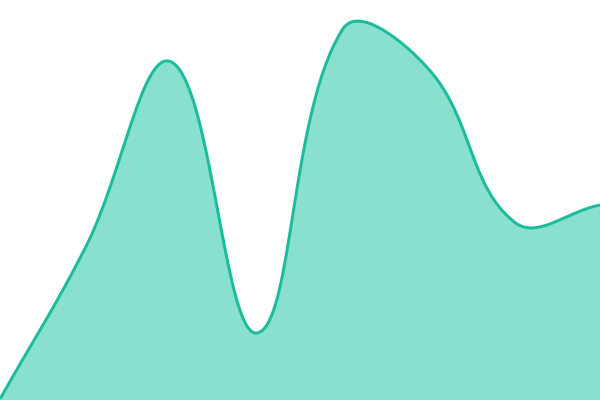
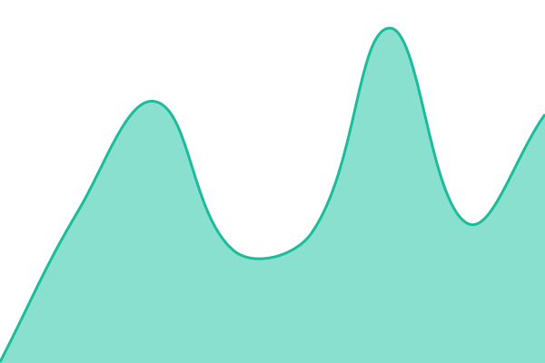

# [📈 Live Status](https://status.eyeverse.world): <!--live status--> **🟩 All systems operational**

This repository contains the open-source uptime monitor and status page for [Eye Labs](https://eyelabs.xyz), powered by [Upptime](https://github.com/upptime/upptime).

With [Upptime](https://upptime.js.org), you can get your own unlimited and free uptime monitor and status page, powered entirely by a GitHub repository. We use [Issues](https://github.com/Eye-Labs-inc/eyeverse-status/issues) as incident reports, [Actions](https://github.com/Eye-Labs-inc/eyeverse-status/actions) as uptime monitors, and [Pages](https://status.eyeverse.world) for the status page.

<!--start: status pages-->
<!-- This summary is generated by Upptime (https://github.com/upptime/upptime) -->
<!-- Do not edit this manually, your changes will be overwritten -->
<!-- prettier-ignore -->
| URL | Status | History | Response Time | Uptime |
| --- | ------ | ------- | ------------- | ------ |
|  [Eyeverse.world](https://eyeverse.world) | 🟩 Up | [eyeverse-world.yml](https://github.com/Eye-Labs-inc/eyeverse-status/commits/HEAD/history/eyeverse-world.yml) | 

 239ms
     
 | 

<a href="https://status.eyeverse.world/history/eyeverse-world">100.00%</a>
    

|  [Eyeverse Wiki](https://wiki.eyeverse.world) | 🟩 Up | [eyeverse-wiki.yml](https://github.com/Eye-Labs-inc/eyeverse-status/commits/HEAD/history/eyeverse-wiki.yml) | 

 762ms
     
 | 

<a href="https://status.eyeverse.world/history/eyeverse-wiki">100.00%</a>
    

|  [Blood of Ape](https://bloodofape.eyeverse.world) | 🟩 Up | [blood-of-ape.yml](https://github.com/Eye-Labs-inc/eyeverse-status/commits/HEAD/history/blood-of-ape.yml) | 

 849ms
     
 | 

<a href="https://status.eyeverse.world/history/blood-of-ape">100.00%</a>
    

|  [Eyeverse Map](https://map.eyeverse.world) | 🟩 Up | [eyeverse-map.yml](https://github.com/Eye-Labs-inc/eyeverse-status/commits/HEAD/history/eyeverse-map.yml) | 

 121ms
     
 | 

<a href="https://status.eyeverse.world/history/eyeverse-map">100.00%</a>
    

|  [Eyeverse Metadata](https://metadata.eyeverse.world) | 🟩 Up | [eyeverse-metadata.yml](https://github.com/Eye-Labs-inc/eyeverse-status/commits/HEAD/history/eyeverse-metadata.yml) | 

 196ms
     
 | 

<a href="https://status.eyeverse.world/history/eyeverse-metadata">100.00%</a>
    

<!--end: status pages-->

[**Visit our status website →**](https://status.eyeverse.world)

## 📄 License

- Powered by: [Upptime](https://github.com/upptime/upptime)
- Code: [MIT](./LICENSE) © [Anand Chowdhary](https://anandchowdhary.com)
- Data in the `./history` directory: [Open Database License](https://opendatacommons.org/licenses/odbl/1-0/)
